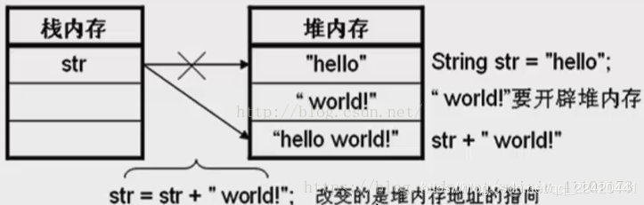
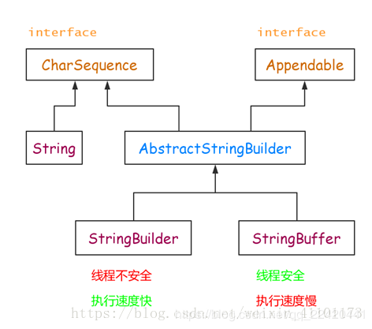

## String

字符串广泛应用 在Java 编程中，在 Java 中字符串属于对象，Java 提供了 String 类来创建和操作字符串。

串也是数据结构的一种

需要注意的是，String的值是不可变的，这就导致每次对String的操作都会生成新的String对象，这样不仅效率低下，而且大量浪费有限的内存空间。我们来看一下这张对String操作时内存变化的图：

我们可以看到，初始String值为“hello”，然后在这个字符串后面加上新的字符串“world”，这个过程是需要重新在栈堆内存中开辟内存空间的，最终得到了“hello world”字符串也相应的需要开辟内存空间，这样短短的两个字符串，却需要开辟三次内存空间，不得不说这是对内存空间的极大浪费。为了应对经常性的字符串相关的操作，谷歌引入了两个新的类——StringBuffer类和StringBuild类来对此种变化字符串进行处理。

## StringBuffer 和 StringBuilder

当对字符串进行修改的时候，需要使用 StringBuffer 和 StringBuilder 类。

和 String 类不同的是，StringBuffer 和 StringBuilder 类的对象能够被多次的修改，并且不产生新的未使用对象。

StringBuilder 类在 Java 5 中被提出，它和 StringBuffer 之间的最大不同在于 StringBuilder 的方法不是线程安全的（不能同步访问）。

由于 StringBuilder 相较于 StringBuffer 有速度优势，所以多数情况下建议使用 StringBuilder 类。

然而在应用程序要求线程安全的情况下，则必须使用 StringBuffer 类。

**三者的继承结构**

## 三者比较

~~~ java
public final class String
    implements java.io.Serializable, Comparable<String>, CharSequence {
    /** The value is used for character storage. */
    private final char value[];
 
    /** Cache the hash code for the string */
    private int hash; // Default to 0
}

~~~

都有char数组 成员

### 字符修改上的区别（主要）

String：不可变字符串；

StringBuffer：可变字符串、效率低、线程安全（在方法上加synchronized）；

StringBuilder：可变字符序列、效率高、线程不安全；

### 初始化上的区别，String可以空赋值，后者不行，报错

#### String

StringBuffer s = null;   

StringBuffer s = “abc”;   

#### StringBuffer

StringBuffer s = null; //结果警告：Null pointer access: The variable result can only be null at this location

StringBuffer s = new StringBuffer();//StringBuffer对象是一个空的对象

StringBuffer s = new StringBuffer(“abc”);//创建带有内容的StringBuffer对象,对象的内容就是字符串”

## 小结

- 如果要操作少量的数据用 String；

- 多线程操作字符串缓冲区下操作大量数据 StringBuffer（目前已经不推荐使用）；

- 单线程操作字符串缓冲区下操作大量数据 StringBuilder（推荐使用）。