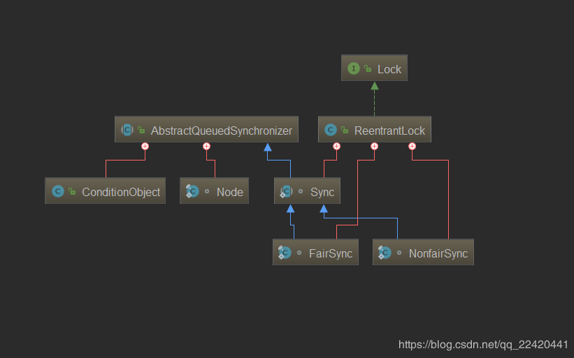
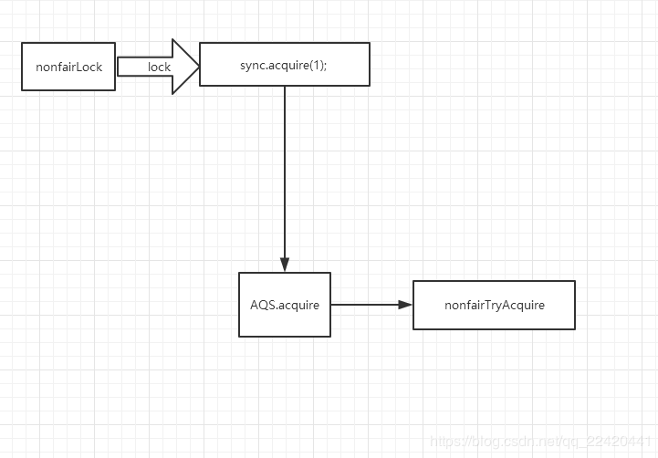
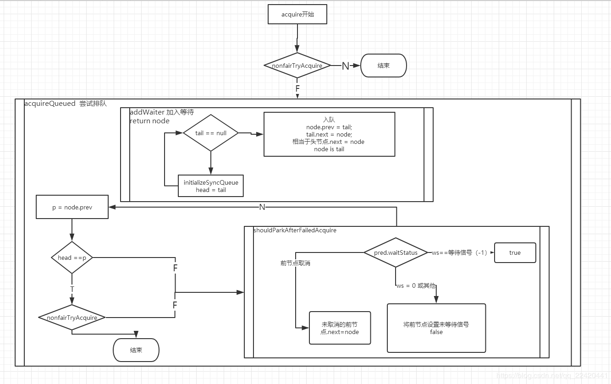
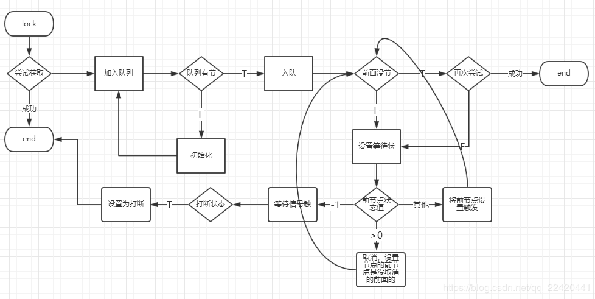

## 结构

首先看看ReentranLock结构，它实现Lock接口，也拥有Sync ，NonfairSync, FairSync三个内部类，

（ NonfairSync, FairSync   ）-----继承-------> Sync ------继承-------> AbstractQueuedSynchronizer

NonfairSync ,FairSync 重写了AQS 的 tryAcquire 

### 构造方式：
~~~ java
public ReentrantLock() {
    sync = new NonfairSync();
}
public ReentrantLock(boolean fair) {
    sync = fair ? new FairSync() : new NonfairSync();
}
~~~
ReentrantLock 默认实现非公平锁，构造为true时才构造公平锁

### Nonfair.lock 流程

~~~ java
ReentrantLock.class
 
public void lock() {
    sync.acquire(1);
}

AQS.class
 
public final void acquire(int arg) {
// 尝试获取不成功 并且加入队发现线程被打断了，
// 设置当前线程打断了
    if (!tryAcquire(arg) &&
        acquireQueued(addWaiter(Node.EXCLUSIVE), arg))
        selfInterrupt();
}
~~~ 
非公平锁上锁时，调用sync的acquire，sync的acquire实则继承AQS的acquire方法，

获取：先尝试获取，不成功再加入等待队

最终的实现tryAcquire 就是ReetranLock.Sync.nonfairTryAcquire方法
~~~ java
 final boolean nonfairTryAcquire(int acquires) {
            // 当前线程
            final Thread current = Thread.currentThread();
            // 获取AQS状态值
            int c = getState();
            if (c == 0) {
                // 没锁，cas ，直接获取锁
                if (compareAndSetState(0, acquires)) {
                    // 将当前线程设置为锁的拥有线程
                    setExclusiveOwnerThread(current);
                    return true;
                }
            }
            else if (current == getExclusiveOwnerThread()) {
                // 当前线程就是拥有锁的线程 （重入） 记录重入次数 ++
                int nextc = c + acquires;
                if (nextc < 0)
                    // overflow
                    throw new Error("Maximum lock count exceeded");
                // 更新状态值
                setState(nextc);
                return true;
            }
            return false;
        }
~~~
加入等待队列

~~~ java
acquireQueued(addWaiter(Node.EXCLUSIVE), arg)
Node.EXCLUSIVE = null 标记 独占模式节点
 
private Node addWaiter(Node mode) {
        Node node = new Node(mode);
 
         for (;;) {
            //获取尾节点
            Node oldTail = tail;
 
            if (oldTail != null) {
            // 尾节点不为空 证明当前队列有值
 
 
                // 将尾节点（tail）设置为node的前节点
                node.setPrevRelaxed(oldTail);
 
                // cas 将尾节点设置为node
                if (compareAndSetTail(oldTail, node)) {
                    // 之前尾节点的下一个节点指向 node
                    oldTail.next = node;
                    // 处理成功 返回node
                    return node;
                }
            } else {
            // 队列为空 初始化队
                initializeSyncQueue();
            }
        }
    }
 
 
 // 初始化同步队列
    private final void initializeSyncQueue() {
        Node h;
        if (HEAD.compareAndSet(this, null, (h = new Node())))
            tail = h;
    }
~~~
~~~ java
final boolean acquireQueued(final Node node, int arg) {
        try {
            boolean interrupted = false;
            for (;;) {
                // 节点的上一个节点
                final Node p = node.predecessor();
                // 上一节点指向头节点 并且 再一次尝试获取 
                if (p == head && tryAcquire(arg)) {
                // 此时获取成功
                    setHead(node);
                    p.next = null; // help GC
                    // 没有被打断
                    return interrupted;
                }
                if (shouldParkAfterFailedAcquire(p, node) &&
                    parkAndCheckInterrupt())
                    // 尝试失败--->阻塞 ---->继续验证是否被打断
                    interrupted = true;
            }
        } catch (Throwable t) {
            // 发生了异常 取消尝试
            cancelAcquire(node);
            throw t;
        }
    }
 
 
 
    // 节点的上一个节点
    final Node predecessor() throws NullPointerException {
            Node p = prev;
            if (p == null)
                throw new NullPointerException();
            else
                return p;
        }
 
 
 
        // 尝试失败后是否阻塞
 
        private static boolean shouldParkAfterFailedAcquire(Node pred, Node node) {
        int ws = pred.waitStatus;
        if (ws == Node.SIGNAL)
            /*
             * 前节点已经是等待触发状态
             */
            return true;
        if (ws > 0) {
            /*
             * 前节点取消了排队
             */
            do {
                node.prev = pred = pred.prev;
            } while (pred.waitStatus > 0);
             // 寻找没取消的前。。。前节点
 
            pred.next = node;
        } else {
           // 将上一节点设置为等待触发
            pred.compareAndSetWaitStatus(ws, Node.SIGNAL);
        }
        return false;
    }
~~~

从源码中看出 作者编程一般使用 && 来判断是否进行下一步

用死循环递归

1.尝试获取 成功就结束了，不成功：加入队列；

2.先加入等待队列，

1）队列操作：

队列有节点，直接入队，将当天节点设置为尾节点，

队列没节点，初始化一个空队列，首尾相同 head = tail ，进行上面操作。

2）再次尝试，设置等待状态 ，去除取消的节点，判断当前被打断

再次尝试：如果这是前面没有节点了，也就是头节点是当前节点的前置节点，再次尝试获取

设置等待状态（判断前节点状态）：等待触发-->判断被打断；取消--->设置节点的前节点是未取消的前面节点；初始或其他状态-->将前节点设置为等待触发 ，然后在进行上面操作循环。

判断被打断：
