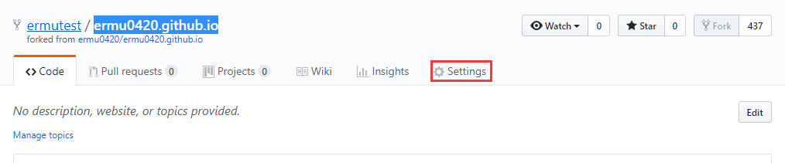
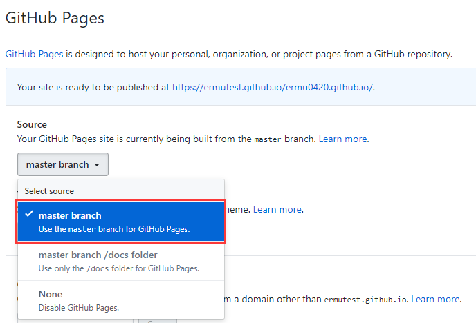
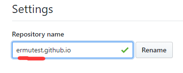
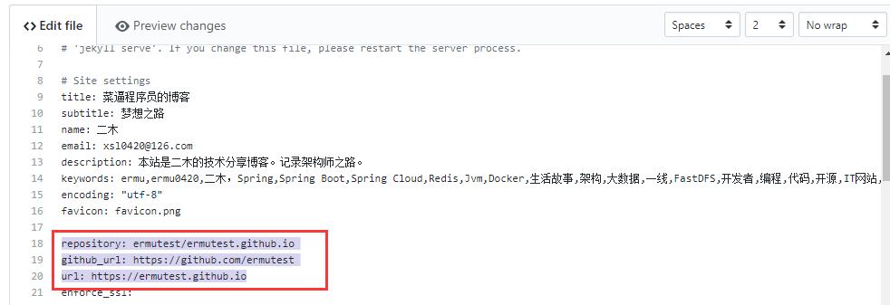
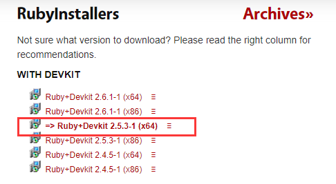
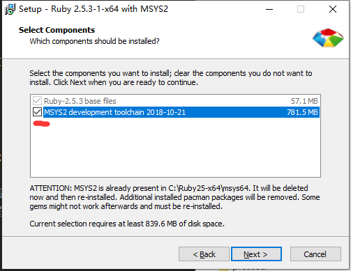
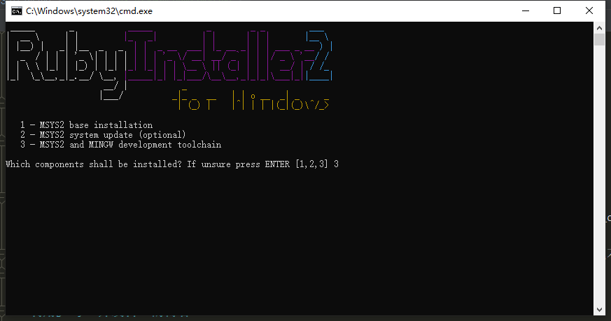
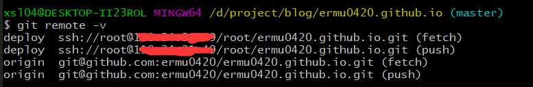
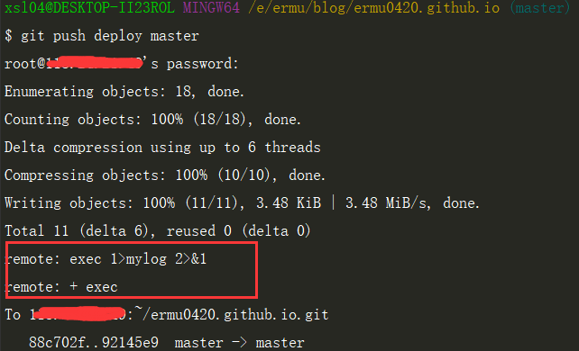

# 如何搭建并自动化部署自己的博客

## GitHub Pages 快速搭建
文章参考:纯洁的微笑的[技术人如何快速搭建自己的博客](http://www.ityouknow.com/other/2018/09/16/create-blog.html)

1. 选择一个博客模板fork，例如地址：[https://github.com/ermu0420/ermu0420.github.io ](https://github.com/ermu0420/ermu0420.github.io) 

2. 设置 GitHub Pages  
点击项目的Settings  然后滚动到 GitHub Pages 
 
 
3. 重命名项目  
点开Settings,按钮打开设置页面，重命名项目名称为：[username].github.io。点击Rename
 
    > username 就是你github 的登录名

4. 修改项目配置文件 _config.yml然后提交  
    ~~~
    repository: username/username.github.io
    github_url: https://github.com/username
    url: https://username.github.io
    ~~~
     
5. 进入 https://username.github.io/ 博客就正常运行了 

一个简单的博客到此就构建完成
### GitHub Pages博客修改成自己域名  
将自己的域名解析到地址 ` username.github.io ` 然后在项目GitHub Pages设置成自己的域名，同时配置_config.yml的`url:`为自己的域名。

GitHub Pages 虽然搭建方便，但是不能被Baidu建检索，同时因为GitHub 是国外服务器，网络访问稳定性也不高。  
为了解决这一系列问题，我将博客代码放置自己的Git仓库中，同时配置了自动部署更新，同时将构建更新的代码交给Nginx代理。

## 利用Jekyll开发自己的博客
 Jekyll [详细教程地址:](https://www.jekyll.com.cn/docs/home/)https://www.jekyll.com.cn/docs/home/
 Windows建立开发环境 CentOs建立部署环境
### Windows安装Ruby+devkit
1. [下载Ruby+devkit：](https://rubyinstaller.org/downloads/) https://rubyinstaller.org/downloads/
 
2. 安装 
 
 
在安装是一定要勾选MSYS2 ，并且要安装MSYS2环境

### Linux 安装 Rvm+Ruby
#### 安装Rvm
~~~
[root@VM_0_17_centos ~]# gpg2 --recv-keys 409B6B1796C275462A1703113804BB82D39DC0E3 7D2BAF1CF37B13E2069D6956105BD0E739499BDB
[root@VM_0_17_centos ~]# \curl -sSL https://get.rvm.io | bash -s stable --rails
[root@VM_0_17_centos ~]# source /usr/local/rvm/scripts/rvm
[root@VM_0_17_centos ~]# source  /etc/profile.d/rvm.sh

[root@VM_0_17_centos ~]# rvm -v
rvm 1.29.7 (latest) by Michal Papis, Piotr Kuczynski, Wayne E. Seguin [https://rvm.io]
# 安装成功
~~~
#### 安装Ruby
~~~
[root@VM_0_17_centos ~]# rvm requirements
[root@VM_0_17_centos ~]# rvm list known 
# 查看可安装列表
[root@VM_0_17_centos ~]# rvm install 2.5.3
# 国内安装很慢
[root@VM_0_17_centos ~]# gem -v
2.7.7
~~~
### Windows和Linux安装Jekyll
~~~
# 添加中国Ruby镜像
gem sources --add https://gems.ruby-china.com/ --remove https://rubygems.org/
gem sources -l
    *** CURRENT SOURCES ***
    
    https://gems.ruby-china.com/
gem install jekyll bundle
jekyll -v
    jekyll 3.8.5
~~~
环境都搭建好了接下来就是配置自动部署
#### Linux 建立项目仓库 
~~~
[root@VM_0_17_centos ~]# mkdir ermu0420.github.io.git
[root@VM_0_17_centos ~]# cd ermu0420.github.io.git
[root@VM_0_17_centos ermu0420.github.io.git]# git --bare init
~~~
#### 配置项目代码地址
~~~
[root@VM_0_17_centos ~]# mkdir /var/www/ermu0420.github.io
# 修改Nginx配置
[root@VM_0_17_centos ~]# vim /usr/local/nginx/conf/nginx.conf

location / {
            root  /var/www/ermu0420.github.io;
            index  index.html index.htm;
        }

~~~
#### 配置Git post-receive钩子
~~~
[root@VM_0_17_centos ~] cd /root/ermu0420.github.io.git/hooks/
[root@VM_0_17_centos hooks]# cp post-receive.sample post-receive
# 如果post-receive 文件不存在 直接vim建立一个新的
[root@VM_0_17_centos ermu0420.github.io.git]# vim post-receive

#!/bin/sh
#打印日志
set -xv
exec 1>mylog 2>&1

#拉取代码
git clone /root/ermu0420.github.io.git /root/tmp/ermu0420.github.io

cd /root/tmp/ermu0420.github.io

#构建项目到/var/www文件夹中
bundle update
bundle exec jekyll build -s /root/tmp/ermu0420.github.io -d /var/www/ermu0420.github.io

#删除拉取的代码
rm -Rf /root/tmp/ermu0420.github.io

# 最后给与脚本执行的权限
[root@VM_0_17_centos ermu0420.github.io.git]# chmod +x post-receive
~~~
### Windows开发以及推送
1. 拉取GitHub上代码 git@github.com:ermu0420/ermu0420.github.io.git
2. 加入自己服务器的远程仓库 git remote add origin ssh://root@www.xxx.com/root/ermu0420.github.io.git
 
3. jekyll运行开发服务并实时更新 bundle exec jekyll serve --watch
4. 修改完成后推送到服务器自动化部署 git push deploy master 
推送时可看见服务器在执行我们设置的命令。同时可在服务器中查看shell的执行日志
 
5. 同时将代码推送到GitHub 同步更新 git push origin master 