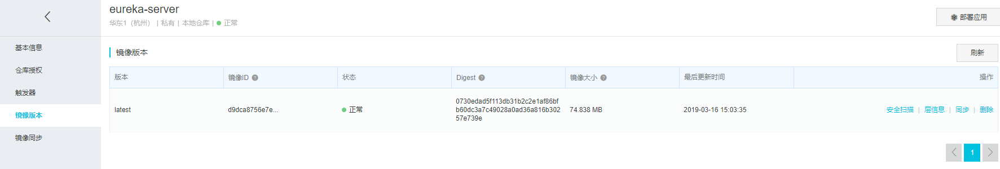

# docker-maven 插件使用
本实例在spring-cloud-eureka用例的基础上进行配置docker-maven插件  

[spring-cloud用例](/spring-cloud/2019-03-15-spring-cloud-eureka.html)  

[源代码地址：https://github.com/ermu0420/docker-example/tree/master/docker-eureka-server](https://github.com/ermu0420/docker-example/tree/master/docker-eureka-server)
## 父POM中加入管理Maven Docker插件
~~~ xml
    <build>
        <!--添加利用maven插件构建docker镜像的插件依赖-->
        <pluginManagement>
            <plugins>
                <plugin>
                    <groupId>com.spotify</groupId>
                    <artifactId>docker-maven-plugin</artifactId>
                    <!--0.4.3-->
                    <version>${docker.plugin.version}</version>
                </plugin>
            </plugins>
        </pluginManagement>
    </build>
~~~
## eureka项目中添加该插件
~~~ xml
<build>
        <finalName>eureka-server</finalName>
        <plugins>
            <plugin>
                <groupId>org.springframework.boot</groupId>
                <artifactId>spring-boot-maven-plugin</artifactId>
            </plugin>
            <plugin>
                <groupId>com.spotify</groupId>
                <artifactId>docker-maven-plugin</artifactId>
                <version>${docker.plugin.version}</version>
            </plugin>
        </plugins>
    </build>

~~~
## 插件使用
### 简单使用
1.修改eureka pom.xml
~~~ xml
    <build>
        <plugins>
            <plugin>
                <groupId>com.spotify</groupId>
                <artifactId>docker-maven-plugin</artifactId>
                <version>${docker.plugin.version}</version>
                <configuration>
                    <!-- 基础镜像 -->
                    <baseImage>java:openjdk-8-jre-alpine</baseImage>
                    <!-- 注意imageName一定要是符合正则[a-z0-9-_.]的，否则构建不会成功 -->
                    <!-- 详见：https://github.com/spotify/docker-maven-plugin    Invalid repository name ... only [a-z0-9-_.] are allowed-->
                    <imageName>${docker.image.prefix}/${project.build.finalName}</imageName>
                    <!-- 镜像tags -->
                    <imageTags>${project.version}</imageTags>
                    <!-- ENTRYPOINT命令 -->
                    <entryPoint>["java", "-jar", "/${project.build.finalName}.jar"]</entryPoint>
                    <resources>
                        <resource>
                            <targetPath>/</targetPath>
                            <directory>${project.build.directory}</directory>
                            <include>${project.build.finalName}.jar</include>
                        </resource>
                    </resources>
                </configuration>
            </plugin>
        </plugins>
    </build>
~~~
2.执行命令：
> mvn clean package docker:build
此时镜像虽然是构建到本地，但是是构建到服务端的，所以要打开访问端口

~~~ sh
$ docker images
REPOSITORY               TAG                    IMAGE ID            CREATED             SIZE
ermu0420/eureka-server   1.0-SNAPSHOT           58fee97dc920        24 seconds ago      148MB
ermu0420/eureka-server   latest                 58fee97dc920        24 seconds ago      148MB
java                     openjdk-8-jre-alpine   fdc893b19a14        2 years ago         108MB
~~~

### Dockerfile构建
1./src/main/docker下创建 Dockerfile文件
~~~ java
FROM java:openjdk-8-jre-alpine
VOLUME /tmp
ADD eureka-server.jar app.jar
RUN bash -c 'touch /app.jar'
ENTRYPOINT ["java","-Djava.security.egd=file:/dev/./urandom","-jar","/app.jar"]
~~~
启动容器
~~~ sh
$ docker run --name=peer1 -e spring.profiles.active=peer1 -d -p 8761:8761 ermu0420/eureka-server:1.0-SNAPSHOT
$ docker run --name=peer2 -e spring.profiles.active=peer2 -d -p 8762:8762 ermu0420/eureka-server:1.0-SNAPSHOT
$ docker run --name=peer3 -e spring.profiles.active=peer3 -d -p 8763:8763 ermu0420/eureka-server:1.0-SNAPSHOT
~~~
~~~ sh
$ docker ps
CONTAINER ID        IMAGE                                 COMMAND                  CREATED             STATUS              PORTS                    NAMES
0674a71f76fe        ermu0420/eureka-server:1.0-SNAPSHOT   "java -jar /eureka-s…"   5 seconds ago       Up 3 seconds        0.0.0.0:8763->8763/tcp   peer3
f130b438922c        ermu0420/eureka-server:1.0-SNAPSHOT   "java -jar /eureka-s…"   12 seconds ago      Up 11 seconds       0.0.0.0:8762->8762/tcp   peer2
b235adea88b7        ermu0420/eureka-server:1.0-SNAPSHOT   "java -jar /eureka-s…"   2 minutes ago       Up 2 minutes        0.0.0.0:8761->8761/tcp   peer1
~~~
访问http://localhost:8761/，http://localhost:8762/，http://localhost:8763/都显示正常

2.eureka pom文件

~~~ xml
<build>
    <finalName>eureka-server</finalName>
    <plugins>
        <plugin>
            <groupId>com.spotify</groupId>
            <artifactId>docker-maven-plugin</artifactId>
            <version>${docker.plugin.version}</version>
            <!-- 将docker 构建加入 maven package中 -->
            <executions>
                <execution>
                    <phase>package</phase>
                    <goals>
                        <goal>build</goal>
                    </goals>
                </execution>
            </executions>
            <configuration>
                <imageName>${docker.image.prefix}/${project.build.finalName}</imageName>
                <!-- 镜像tags -->
                <imageTags>${project.version}</imageTags>
                <!-- docerkfile 所在的目录 -->
                <dockerDirectory>${project.basedir}/src/main/docker</dockerDirectory>
                <resources>
                    <resource>
                        <targetPath>/</targetPath>
                        <directory>${project.build.directory}</directory>
                        <include>${project.build.finalName}.jar</include>
                    </resource>
                </resources>
            </configuration>
        </plugin>
    </plugins>
</build>
~~~

3.执行命令：
> mvn clean package
在maven打包的同时就会通过dockerfile将docker镜像构建在本地  
同样执行启动镜像命令跟简单实用一样

### docker-compose 配置启动
1.配置docker-compose文件
~~~ sh
version: '3'
services:
  peer1:
    image: ermu0420/eureka-server
    #    deploy:
    #      replicas: 1   #定义 replicated 模式的服务的复本数量
    #      update_config:
    #        parallelism: 1    #每次更新复本数量
    #        delay: 2s       #每次更新间隔
    #      restart_policy:
    #        condition: on-failure     #定义服务的重启条件
    #      networks:
    #      - eureka-net
    ports:
    - "8761:8761"
    environment:
    - spring.profiles.active=peer1
  peer2:
    image: ermu0420/eureka-server
    ports:
    - "8762:8762"
    environment:
    - spring.profiles.active=peer2
  peer3:
    image: ermu0420/eureka-server
    ports:
    - "8763:8763"
    environment:
    - spring.profiles.active=peer3
#networks:
#  eureka-net:            #网络名称
#    driver: overlay

~~~
2.docker一定要启用docker stack不然会出现报错
~~~ sh
xsl04@DESKTOP-II23ROL MINGW64 /d/project/docker-example/eureka-server (master)
$ docker stack deploy -c docker-compose.yml eureka
Get https://localhost:6445/api?timeout=32s: EOF

~~~

## 将镜像push到私有仓库 
这里以阿里云仓库为例  

1.maven的setting.xml中加入
~~~ xml
<servers>
  <server>
    <id>docker-registry</id>
    <username>用户名</username>
    <password>registry密码 不是阿里云登录密码</password>
    <configuration>
      <email>邮箱</email>
    </configuration>
  </server>
</servers>
~~~
2.修改项目的pom.xml
~~~ xml
<plugin>
    <groupId>com.spotify</groupId>
    <artifactId>docker-maven-plugin</artifactId>
    <version>${docker.plugin.version}</version>
    <!-- 将docker 构建加入 maven package中 -->
    <executions>
        <execution>
            <phase>package</phase>
            <goals>
                <goal>build</goal>
                <goal>push</goal>
            </goals>
        </execution>
    </executions>
    <configuration>
        <imageName>registry.cn-hangzhou.aliyuncs.com/${docker.image.prefix}/${project.build.finalName}</imageName>
        <!-- docerkfile 所在的目录 -->
        <dockerDirectory>${project.basedir}/src/main/docker</dockerDirectory>
        <resources>
            <resource>
                <targetPath>/</targetPath>
                <directory>${project.build.directory}</directory>
                <include>${project.build.finalName}.jar</include>
            </resource>
        </resources>

        <!-- 与maven配置文件settings.xml serverId一致 -->
        <serverId>aliyun-docker-registry</serverId>
    </configuration>
</plugin>
~~~
