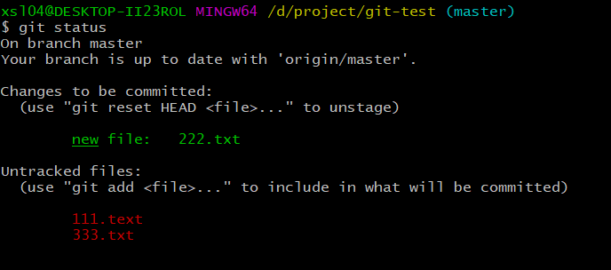

# Git 

## Git 与 SVN 对比
- GIT:分布式（Distributed），变化的保存全部（copy），当前未变化的文件指向上一个版本
- SVN:集中式（centralized ），提交文件（修改），纪录的是变化
<!-- more -->

## Git 逻辑状态

## Git flow

## 常用命令
### config
~~~ sh
 git config --global user.name 'ermu'  
 git config --global user.email 'xsl0420@126.com'
 ssh-keygen -t rsa -C 'xsl0420@126.com'  //ssh key 
~~~

### start
~~~ sh
 git init 文件加入Git管理
 git --bare init 初始化一个git仓库
 git remote add [name] [url] // 建立与远程仓库连接
 git clone ..... 拷贝git文件
~~~

### 查看信息
~~~ sh
git status  文件状态 
git log --graph 退出输入q
git show 
~~~

### remote 远程仓库
~~~ sh
git remote -v  已建立的所有远程连接 
git remote add [name] [url]  添加远程连接
git remote rm [name] 移除
git remote set-url --push [name] [url] 修改远程地址
git remote rename [oldname] [newname] 重命名
~~~

### branch 分支
~~~ sh
git branch -a 所有分支
git branch -r 其他所有分支 
git branch [name] 创建新分支
git checkout -b [name] 创建新分支并切换
git checkout [name] 切换分支
git branch -d [name] 删除分支
git push origin :heads/[name] 删除远程分支 慎用
~~~

### commit 提交
~~~ sh
git commit -m [markinfo]
git commit --amend [markinfo]// 修正提交
~~~

### fetch 获取
~~~ sh
git fetch [name] [branchname]
~~~

### pull 拉取
~~~ sh
git pull [name]  [branchname] 
~~~
> pull = fetch + merge

### push 推送
~~~ sh
git push [name] [branchname]
git push --set-upstream [name] [branchname]
~~~

### merge/rebase

### tag 标签
~~~ sh
git tag [name]  创建
git tag -a [name] -m 'info'  创建有描述的分支
git tag -d [name] 删除
git tag -l 分支列表 
git push [origin] --tags 推送分支
git pull [origin] --tags 拉取分支 
git push origin :refs/tags/[name]  删除远端分支
~~~

### 还原
reset ： 回退到之前某版本 之后版本会丢失  
revert： 将某版本的修改还原

~~~ sh
git reset --hard xxxxxx 
git revert [commitId] 
还原修改的文件 
git chckout -- file 
git chckout -- directory/
~~~
## 一些场景Git使用
### 新建GitHub项目并提交
- 方式一
    - GitHub上建立项目例如
    - 拉取到本地
    - 本地修改了推送到GitHub
    ~~~ sh
        git clone https://github.com/ermu0420/git-test.git
        ## 修改 提交
        git add . 
        git commit -m 'init'
        git push
    ~~~
- 方式二
    - 本地建立项目
    - GitHub上建立项目
    - 本地项目与GitHub上链接
    - 推送至GitHub
    ~~~ sh
        git init 
        git remote add origin https://github.com/ermu0420/git-test.git
        ## 修改 提交
        git add . 
        git commit -m 'init'
        git push -u origin master
    ~~~
    
### 修改或者添加的文件不想修改还原
- 新增

    - 还未添加到本地Staged  例如 111.text 333.txt
    ~~~ sh
        ### 直接删除 
       $ rm -r 111.text
       $ rm -r 333.txt
       $ git status
       On branch master
       Your branch is up to date with 'origin/master'.
       
       Changes to be committed:
         (use "git reset HEAD <file>..." to unstage)
       
               new file:   222.txt
    ~~~
    - 已经加入了版本控制 例如 222.txt 
    ~~~ sh
    $ git reset HEAD 222.txt  # 从版本控制中移除
    $ rm -r 222.txt #再删除
    或者
    $ git rm -f 222.txt
    ~~~
- 修改 

    - 还未添加到本地Staged  例如  333.txt
    ~~~ sh
        git checkout -- 333.txt
        git checkout . # 还原所有的
    ~~~
    - 已经加入了版本控制 例如 222.txt 
    ~~~ sh
        $ git reset HEAD 222.txt  # 从版本控制中移除
        $ git checkout -- 222.txt
    ~~~
### 中文乱码解决方案
        git config --global core.quotepath false
    