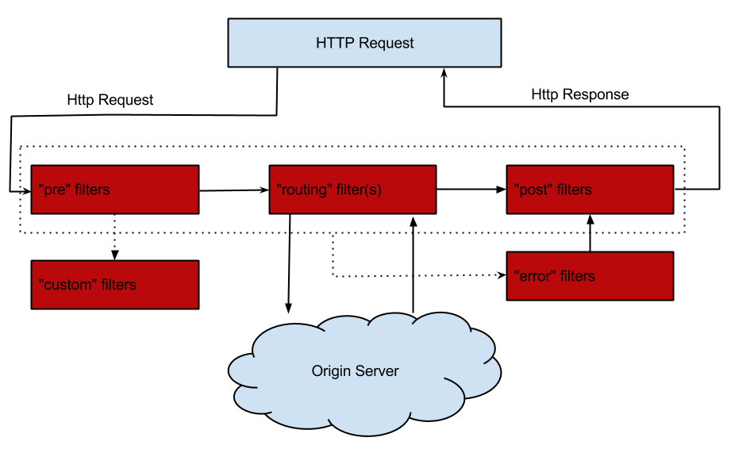

## API网关

在微服务架构中,常常一个大的应用会被拆分成几个小的应用服务,而这几个小的应用服务又可以自成体系。于是取而代之的是多个不同的service被彼此独立的部署，拥有自己独立的数据库，框架，语言等。但是在UI上进行展示的时候，我们通常需要在一个界面上展示很多数据，这些数据可能来自于不同的微服务中。而这时问题就来了，在去调用很多个服务的数据时，你得记住每个相应服务的地址，这样就导致服务调用时很麻烦。况且在对服务进行部署时，服务的实例的数量也是动态变化的，客户端也很难去判断决定调用的地址。

另外就时调用时权限的问题，在你调用时去请求了鉴权服务拿到了相应的票据，再去调用想用服务时，每个服务还得根据你的票据去进行验证。因此在服务架构中为了解决这些问题，就加入了API网关。

API网关也是一个服务，它是系统的唯一入口，其它的服务不会向外暴露。API网关封装了系统内部架构，可以为每个客户端提供一个定制的API，并且可以做身份验证、监控、负载均衡、缓存、请求分片与管理、静态响应处理等。

在Spring Cloud 体系中API网关有Spring Cloud Zuul 和 Spring Cloud Gateway。

## Spring Cloud Zuul

Spring Cloud Zuul路由是微服务架构的不可或缺的一部分，提供动态路由，监控，弹性，安全等的边缘服务。Zuul是Netflix出品的一个基于JVM路由和服务端的负载均衡器。

### 路由

1. 引入zuul的依赖

```xml
<dependencies>
    <dependency>
        <groupId>org.springframework.cloud</groupId>
        <artifactId>spring-cloud-starter</artifactId>
    </dependency>
    <dependency>
        <groupId>org.springframework.cloud</groupId>
        <artifactId>spring-cloud-starter-netflix-eureka-client</artifactId>
    </dependency>
    <dependency>
        <groupId>org.springframework.cloud</groupId>
        <artifactId>spring-cloud-starter-netflix-zuul</artifactId>
    </dependency>
</dependencies>
```

2. 启动类中加入zuul启动代理

```java
@EnableZuulProxy
@SpringBootApplication
public class ZuulServiceApplication {
    public static void main(String[] args) {
        SpringApplication.run(ZuulServiceApplication.class, args);
    }
}
```

3. 配置路由转发

```yml
server:
  port: 9000
spring:
  application:
    name: zuul-service
zuul:
  routes:
    service-provider:
      path: /provider/**
#      url: http://ermu0420.club/
      serviceId: provider-service
#      单个应用配置去前缀
#      strip-prefix: false
#     转发前去掉前缀
  strip-prefix: true
# 路由访问前加上这个前缀
  prefix: /api
#  取消敏感的headers
  sensitive-headers: Cookie,Set-Cookie,Authorization
# 忽略
#  ignored-patterns:
eureka:
  client:
    serviceUrl:
      defaultZone: http://localhost:8761/eureka/
```

### Zuul核心-Filter

Filter是Zuul的核心，用来实现对外服务的控制。Filter的生命周期有4个，分别是“PRE”、“ROUTING”、“POST”、“ERROR”，整个生命周期可以用下图来表示。



Zuul大部分功能都是通过过滤器来实现的，这些过滤器类型对应于请求的典型生命周期。

- **PRE：** 这种过滤器在请求被路由之前调用。我们可利用这种过滤器实现身份验证、在集群中选择请求的微服务、记录调试信息等。
- **ROUTING：**这种过滤器将请求路由到微服务。这种过滤器用于构建发送给微服务的请求，并使用Apache HttpClient或Netfilx Ribbon请求微服务。
- **POST：**这种过滤器在路由到微服务以后执行。这种过滤器可用来为响应添加标准的HTTP Header、收集统计信息和指标、将响应从微服务发送给客户端等。
- **ERROR：**在其他阶段发生错误时执行该过滤器。
  除了默认的过滤器类型，Zuul还允许我们创建自定义的过滤器类型。例如，我们可以定制一种STATIC类型的过滤器，直接在Zuul中生成响应，而不将请求转发到后端的微服务。

#### Zuul中默认实现的Filter

| 类型  | 顺序 | 过滤器                  | 功能                       |
| ----- | ---- | ----------------------- | -------------------------- |
| pre   | -3   | ServletDetectionFilter  | 标记处理Servlet的类型      |
| pre   | -2   | Servlet30WrapperFilter  | 包装HttpServletRequest请求 |
| pre   | -1   | FormBodyWrapperFilter   | 包装请求体                 |
| route | 1    | DebugFilter             | 标记调试标志               |
| route | 5    | PreDecorationFilter     | 处理请求上下文供后续使用   |
| route | 10   | RibbonRoutingFilter     | serviceId请求转发          |
| route | 100  | SimpleHostRoutingFilter | url请求转发                |
| route | 500  | SendForwardFilter       | forward请求转发            |
| post  | 0    | SendErrorFilter         | 处理有错误的请求响应       |
| post  | 1000 | SendResponseFilter      | 处理正常的请求响应         |

**禁用指定的Filter**

可以在application.yml中配置需要禁用的filter，格式：

```xml
zuul:
	FormBodyWrapperFilter:
		pre:
			disable: true
```

#### 自定义Filter

我们假设有这样一个场景，因为服务网关应对的是外部的所有请求，为了避免产生安全隐患，我们需要对请求做一定的限制，比如请求中含有Token便让请求继续往下走，如果请求不带Token就直接返回并给出提示。

首先自定义一个Filter，在run()方法中验证参数是否含有Token。

```java
@Slf4j
public class TokenFilter extends ZuulFilter {
    /**
     * filter类型 pre、route、post、error
     *
     * @return
     */
    @Override
    public String filterType() {
        return "pre";
    }

    /**
     * 定义filter的顺序，数字越小表示顺序越高，越先执行
     *
     * @return
     */
    @Override
    public int filterOrder() {
        return 0;
    }

    /**
     * 表示是否需要执行该filter
     *
     * @return
     */
    @Override
    public boolean shouldFilter() {
        return true;
    }

    /**
     * 执行操作
     *
     * @return
     * @throws ZuulException
     */
    @Override
    public Object run() throws ZuulException {
        RequestContext currentContext = RequestContext.getCurrentContext();
        HttpServletRequest request = currentContext.getRequest();

        log.info("--->>> TokenFilter {},{}", request.getMethod(), request.getRequestURL().toString());

        String token = request.getParameter("token");

        if(StringUtils.isNotBlank(token)){
            // 对其路由
            currentContext.setSendZuulResponse(true);
            currentContext.setResponseStatusCode(200);
            currentContext.set("isSuccess",true);
        }else{
            //不对其进行路由
            currentContext.setSendZuulResponse(false);
            currentContext.setResponseStatusCode(400);
            currentContext.setResponseBody("token is empty");
            currentContext.set("isSuccess", false);
        }
        return null;
    }
}
```

将TokenFilter加入到请求拦截队列，在配置类/启动类中添加以下代码：

```java
@Configuration
public class ZuulFilterCongfig {
    @Bean
    public TokenFilter tokenFilter() {
        return new TokenFilter();
    }
}
```

这样就将我们自定义好的Filter加入到了请求拦截中。

**测试**

我们依次启动项目：`eureka`、`provider1`、`provider2`、`zuul`。

访问地址：`http://localhost:9000/provider/provider/port`，返回：token is empty ，请求被拦截返回。 

访问地址：`http://localhost:9000/provider/provider/port?token=xxx`，返回：this is provider-service and port is 8082，说明请求正常响应。

通过上面这例子我们可以看出，我们可以使用“PRE"类型的Filter做很多的验证工作，在实际使用中我们可以结合shiro、oauth2.0等技术去做鉴权、验证。

### 熔断

当我们的后端服务出现异常的时候，我们不希望将异常抛出给最外层，期望服务可以自动进行一降级。Zuul给我们提供了这样的支持。当某个服务出现异常时，直接返回我们预设的信息。

我们通过自定义的fallback方法，并且将其指定给某个route来实现该route访问出问题的熔断处理。主要继承ZuulFallbackProvider接口来实现，ZuulFallbackProvider默认有两个方法，一个用来指明熔断拦截哪个服务，一个定制返回内容。

```java
public interface FallbackProvider {

	/**
	 * The route this fallback will be used for.
	 * @return The route the fallback will be used for.
	 */
	String getRoute();

	/**
	 * Provides a fallback response based on the cause of the failed execution.
	 * @param route The route the fallback is for
	 * @param cause cause of the main method failure, may be <code>null</code>
	 * @return the fallback response
	 */
	ClientHttpResponse fallbackResponse(String route, Throwable cause);

}
```

实现类通过实现getRoute方法，告诉Zuul它是负责哪个route定义的熔断。而fallbackResponse方法则是告诉 Zuul 断路出现时，它会提供一个什么返回值来处理请求。

后来Spring又扩展了此类，丰富了返回方式，在返回的内容中添加了异常信息，因此最新版本建议直接继承类`FallbackProvider` 。

```java
@Slf4j
@Component
public class ProviderFallback implements FallbackProvider {
    /**
     * * 表示所有
     * @return
     */
    @Override
    public String getRoute() {
        return "provider-service";
    }

    @Override
    public ClientHttpResponse fallbackResponse(String route, Throwable cause) {
        if (cause != null && cause.getCause() != null) {
            String reason = cause.getCause().getMessage();
            log.info("{},RequestExcption {}", getRoute(), reason);
        }
        return new ClientHttpResponse() {
            @Override
            public HttpStatus getStatusCode() throws IOException {
                return HttpStatus.OK;
            }

            @Override
            public int getRawStatusCode() throws IOException {
                return 0;
            }

            @Override
            public String getStatusText() throws IOException {
                return "The service is unavailable.";
            }

            @Override
            public void close() {

            }

            @Override
            public InputStream getBody() throws IOException {
                return new ByteArrayInputStream(getStatusText().getBytes());
            }

            @Override
            public HttpHeaders getHeaders() {
                HttpHeaders httpHeaders = new HttpHeaders();
                httpHeaders.setContentType(MediaType.APPLICATION_JSON_UTF8);
                return httpHeaders;
            }
        };
    }
}
```

当服务出现异常时，打印相关异常信息，并返回"The service is unavailable."。

> Zuul 目前只支持服务级别的熔断，不支持具体到某个URL进行熔断。

### 重试

有时候因为网络或者其它原因，服务可能会暂时的不可用，这个时候我们希望可以再次对服务进行重试，Zuul也帮我们实现了此功能，需要结合Spring Retry 一起来实现。下面我们以上面的项目为例做演示。

**添加Spring Retry依赖**

首先在spring-cloud-zuul项目中添加Spring Retry依赖。

```xml
<dependency>
	<groupId>org.springframework.retry</groupId>
	<artifactId>spring-retry</artifactId>
</dependency>
```

**开启Zuul Retry**

再配置文件中配置启用Zuul Retry

```properties
# 是否开启重试功能
zuul:
	retryable: true
ribbon:
#  对当前服务的重试次数
  MaxAutoRetries: 2
#  切换相同Server的次数
  MaxAutoRetriesNextServer: 0
```

这样我们就开启了Zuul的重试功能。

**测试**

我们对provider-service进行改造，在retry方法中添加定时，并且在请求的一开始打印参数。

```java
@GetMapping("/retry")
public String retry() {
  try {
    Thread.sleep(10000);
  } catch (Exception e) {
    log.error(" hello two error", e);
  }
  return "this is provider-service and port is " + port;
}
```

**注意**

开启重试在某些情况下是有问题的，比如当压力过大，一个实例停止响应时，路由将流量转到另一个实例，很有可能导致最终所有的实例全被压垮。说到底，断路器的其中一个作用就是防止故障或者压力扩散。用了retry，断路器就只有在该服务的所有实例都无法运作的情况下才能起作用。这种时候，断路器的形式更像是提供一种友好的错误信息，或者假装服务正常运行的假象给使用者。

不用retry，仅使用负载均衡和熔断，就必须考虑到是否能够接受单个服务实例关闭和eureka刷新服务列表之间带来的短时间的熔断。如果可以接受，就无需使用retry。

## Spring Cloud Gateway

Spring Cloud Gateway 是 Spring Cloud 的一个全新项目，该项目是基于 Spring 5.0，Spring Boot 2.0 和 Project Reactor 等技术开发的网关，它旨在为微服务架构提供一种简单有效的统一的 API 路由管理方式。

Spring Cloud Gateway 作为 Spring Cloud 生态系统中的网关，目标是替代 Netflix Zuul，其不仅提供统一的路由方式，并且基于 Filter 链的方式提供了网关基本的功能，例如：安全，监控/指标，和限流。

- 
- Predicate（断言）：这是一个 Java 8 的 Predicate。输入类型是一个 ServerWebExchange。我们可以使用它来匹配来自 HTTP 请求的任何内容，例如 headers 或参数。
- Filter（过滤器）：

**工作流程：**


客户端向 Spring Cloud Gateway 发出请求。如果 Gateway Handler Mapping 中找到与请求相匹配的路由，将其发送到 Gateway Web Handler。Handler 再通过指定的过滤器链来将请求发送到我们实际的服务执行业务逻辑，然后返回。
过滤器之间用虚线分开是因为过滤器可能会在发送代理请求之前（“pre”）或之后（“post”）执行业务逻辑。

### Routs

```yml
spring:
  application:
    name: gateway-service
  cloud:
    gateway:
      discovery:
        locator:
          enabled: true
          # 在配置了服务发现后就能只能代理其它注册的服务，在该网关地址后加服务名称即可访问
          # http://localhost:9001/PROVIDER-SERVICE
      routes:
        - id: provider_route
          filters:
            - CountTime=true
          uri: http://ermu0420.club
#          lb://应用注册服务名
#          uri: lb://provider-service
          predicates:
            - Path=/spring-cloud/**
```

gateway的路由中主要的成员有`ID`,`一组断言predicates`,`一组过滤器filters`,`目标uri`，如果断言为真，则路由匹配。`uri`可以配置代理的地址，也可以配置注册的应用服务名，格式为：`lb://servicename`。

### Predicate

Predicate 来源于 Java 8，是 Java 8 中引入的一个函数，Predicate 接受一个输入参数，返回一个布尔值结果。该接口包含多种默认方法来将 Predicate 组合成其他复杂的逻辑（比如：与，或，非）。可以用于接口请求参数校验、判断新老数据是否有变化需要进行更新操作。

在 Spring Cloud Gateway 中 Spring 利用 Predicate 的特性实现了各种路由匹配规则，有通过 Header、请求参数等不同的条件来进行作为条件匹配到对应的路由。网上有一张图总结了 Spring Cloud 内置的几种 Predicate 的实现。


### Filter

Spring Cloud Gateway 的 Filter 的生命周期不像 Zuul 的那么丰富，它只有两个：“pre” 和 “post”。

- **PRE**： 这种过滤器在请求被路由之前调用。我们可利用这种过滤器实现身份验证、在集群中选择请求的微服务、记录调试信息等。
- **POST**：这种过滤器在路由到微服务以后执行。这种过滤器可用来为响应添加标准的 HTTP Header、收集统计信息和指标、将响应从微服务发送给客户端等。

Spring Cloud Gateway 的 Filter 分为两种：GatewayFilter 与 GlobalFilter。GlobalFilter 会应用到所有的路由上，而 GatewayFilter 将应用到单个路由或者一个分组的路由上。


#### 自定义filter

Zuul 的 Filter 是通过 `filterType()` 方法来指定，一个 Filter 只能对应一种类型，要么是 “pre” 要么是 “post”。而 Spring Cloud Gateway 基于 Project Reactor 和 WebFlux，采用响应式编程风格，打开它的 Filter 的接口 `GatewayFilter` 你会发现它只有一个方法 `filter`。

自定义过滤器需要实现 `GatewayFilter` 和 `Ordered`。其中 `GatewayFilter` 中的这个方法就是用来实现你的自定义的逻辑的。

假设一个场景：获取调用接口消耗的时间。

```java
@Slf4j
public class CountTimeGatewayFilter implements GatewayFilter, Ordered {
    private static final String TIME_BEGIN = "timeBegin";

    @Override
    public Mono<Void> filter(ServerWebExchange exchange, GatewayFilterChain chain) {
        return getFilter(exchange,chain);
    }

    public static Mono<Void> getFilter(ServerWebExchange exchange, GatewayFilterChain chain){
        exchange.getAttributes().put(TIME_BEGIN,System.currentTimeMillis());
        return chain.filter(exchange).then(
                Mono.fromRunnable(() ->{
                    Long startTime = exchange.getAttribute(TIME_BEGIN);
                    if(startTime != null){
                        log.info("{} : {} ms",exchange.getRequest().getURI().getRawPath(),
                                System.currentTimeMillis() - startTime);
                    }
                })
        );
    }

    /**
     * 值越小 越优先
     * @return
     */
    @Override
    public int getOrder() {
        return Ordered.LOWEST_PRECEDENCE;
    }
}
```

在定义过滤器后就将它与对应的路由做对应并且注入到 Spring当中。

```java
@Bean
public RouteLocator countTimeRouteLocator(RouteLocatorBuilder builder){
    return builder.routes()
            .route("provider_route",
                    n -> n.path("/spring-cloud")
                            .filters(f -> f.filter(new CountTimeGatewayFilter()))
                            .uri("http://ermu0420.club")
            )
            .build();
}
```

#### 自定义的过滤工厂

在定义了过滤器却无法在配置文件中进行配置。那么要怎么样才能在配置中心进行配置呢？我们可以参考源码中其它的过滤器是怎么配置的。例如我们在使用`AddRequestParameter`过滤器时其实代码中是用`AddRequestParameterGatewayFilterFactory`实现的。`AddRequestParameterGatewayFilterFactory`是继承了`AbstractNameValueGatewayFilterFactory`实现了apply方法返回一个`GatewayFilter`,所以参考该过滤工厂写出我们自定义的过滤工厂。

```java
@Slf4j
@Component
public class CountTimeGatewayFilterFactory extends AbstractGatewayFilterFactory<CountTimeGatewayFilterFactory.Config> {
    private static final String TIME_BEGIN = "timeBegin";

    private static final String KEY = "enabled";

    /**
     * 一定要调用一下父类的构造器把 Config 类型传过去，否则会报 ClassCastException
     */
    public CountTimeGatewayFilterFactory(){
        super(Config.class);
    }

    @Override
    public List<String> shortcutFieldOrder() {
        return Arrays.asList(KEY);
    }


    @Override
    public GatewayFilter apply(Config config) {
        return (exchange, chain) -> {
            if(!config.isEnabled()){
                return chain.filter(exchange);
            }
            exchange.getAttributes().put(TIME_BEGIN,System.currentTimeMillis());
            return chain.filter(exchange).then(
                    Mono.fromRunnable(() ->{
                        Long startTime = exchange.getAttribute(TIME_BEGIN);
                        if(startTime != null){
                            log.info("{} : {} ms",exchange.getRequest().getURI().getRawPath(),
                                    System.currentTimeMillis() - startTime);
                        }
                    })
            );
        };
    }

    @NoArgsConstructor
    @Getter
    @Setter
    public static class Config{

        private boolean enabled;
    }
}
```

然后就可以在配置文件中进行使用

```yml
spring:
  application:
    name: gateway-service
  cloud:
    gateway:
      discovery:
        locator:
          enabled: true
      routes:
        - id: provider_route
          filters:
            - CountTime=true
```

### 熔断

Spring Cloud Gateway 也可以利用 Hystrix 的熔断特性，在流量过大时进行服务降级，同样我们还是首先给项目添加上依赖。

**配置示例**

```
spring:
  cloud:
    gateway:
      routes:
      - id: hystrix_route
        uri: http://example.org
        filters:
        - Hystrix=myCommandName
```

配置后，gateway 将使用 myCommandName 作为名称生成 HystrixCommand 对象来进行熔断管理。如果想添加熔断后的回调内容，需要在添加一些配置。

```
spring:
  cloud:
    gateway:
      routes:
      - id: hystrix_route
        uri: lb://provier-service
        predicates:
        - Path=/xxxx
        filters:
        - name: Hystrix
          args:
            name: fallbackcmd
            fallbackUri: forward:/yyyy
```

`fallbackUri: forward:/yyyy`配置了 fallback 时要会调的路径，当调用 Hystrix 的 fallback 被调用时，请求将转发到`/yyyy`这个 URI。

### 重试

RetryGatewayFilter 是 Spring Cloud Gateway 对请求重试提供的一个 GatewayFilter Factory

配置示例：

```
spring:
  cloud:
    gateway:
      routes:
      - id: retry_test
        uri: lb://provier-service
        predicates:
        - Path=/api/provider/retry
        filters:
        - name: Retry
          args:
            retries: 3
            statuses: BAD_GATEWAY
```

Retry GatewayFilter 通过这四个参数来控制重试机制： retries, statuses, methods, 和 series。

- retries：重试次数，默认值是 3 次
- statuses：HTTP 的状态返回码，取值请参考：`org.springframework.http.HttpStatus`
- methods：指定哪些方法的请求需要进行重试逻辑，默认值是 GET 方法
- series：一些列的状态码配置，取值参考：`org.springframework.http.HttpStatus.Series`。符合的某段状态码才会进行重试逻辑，默认值是 SERVER_ERROR，值是 5，也就是 5XX(5 开头的状态码)，共有5 个值。 

### 限流

限流在高并发场景中比较常用的手段之一，可以有效的保障服务的整体稳定性，Spring Cloud Gateway 提供了基于 Redis 的限流方案。所以我们首先需要添加对应的依赖包`spring-boot-starter-data-redis-reactive`

```
<dependency>
  <groupId>org.springframework.cloud</groupId>
  <artifactId>spring-boot-starter-data-redis-reactive</artifactId>
</dependency>
```

配置文件中需要添加 Redis 地址和限流的相关配置

```
spring:
  application:
    name: gateway-service
  redis:
    host: localhost
    password:
    port: 6379
  cloud:
    gateway:
      discovery:
        locator:
#          是否与服务注册于发现组件进行结合
          enabled: true
      routes:
        - id: provider_route
          filters:
            - CountTime=true
            - name: RequestRateLimiter
              args:
                redis-rate-limiter.replenishRate: 10
                redis-rate-limiter.burstCapacity: 20
                key-resolver: "#{@ipKeyResolver}"
```

- filter 名称是 RequestRateLimiter
- redis-rate-limiter.replenishRate：允许用户每秒处理多少个请求
- redis-rate-limiter.burstCapacity：令牌桶的容量，允许在一秒钟内完成的最大请求数
- key-resolver：使用 SpEL 按名称引用 bean

项目中设置限流的策略，创建 Config  类。

```java
@Configuration
public class RateLimiterConfig {
    /**
     * 根据IP进行限流
     *
     * @return
     */
    @Bean
    public KeyResolver ipKeyResolver() {
        return exchange -> Mono.just(exchange.getRequest().getRemoteAddress().getHostName());
    }
}
```

这样网关就可以根据不同策略来对请求进行限流了。

## Zuul 和 GateWay对比

|        | Gateway                                                      | zuul                                                         |
| ------ | ------------------------------------------------------------ | ------------------------------------------------------------ |
|        | 构建于 Spring 5+，基于 Spring Boot 2.x 响应式的、非阻塞式的 API。同时，它支持 websockets，和 Spring 框架紧密集成，开发体验相对来说十分不错。 | Zuul构建于 Servlet 2.5，兼容 3.x，使用的是阻塞式的 API，不支持长连接，比如 websockets。 |
| 路由   | 路由配置比较简单，几乎零配置就可以使用                       | 必须得给没个服务都配置相应的路由                             |
| 功能   | 增加了限流功能                                               | 无                                                           |
| filter | 较多，功能也比较强大                                         | 较少                                                         |

